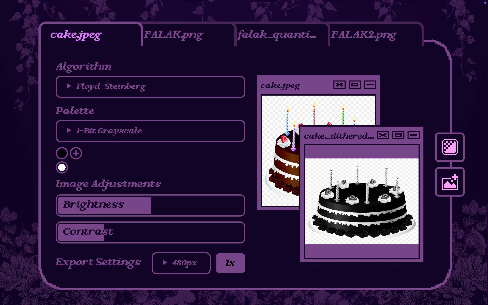
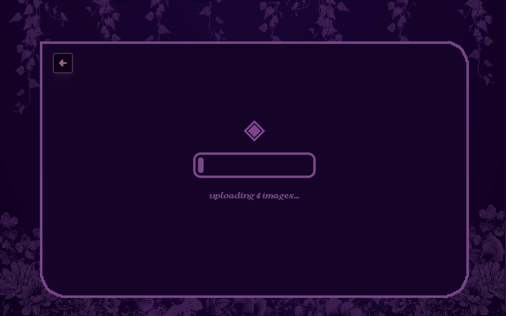
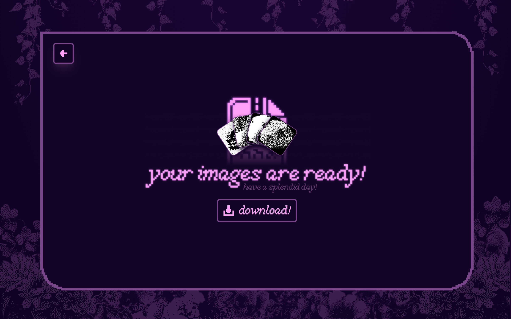

# hither and dither
pursue your pixelated dreams! a full-stack web app made with react, typescript, tailwind, and the PIL image library in python. uses a RESTful API (flask for local dev, aws lambda + api gateway in production) to receive formdata, store images, and deliver dithered images.

## screenshots

## architecture
TODO: make this diagram lole